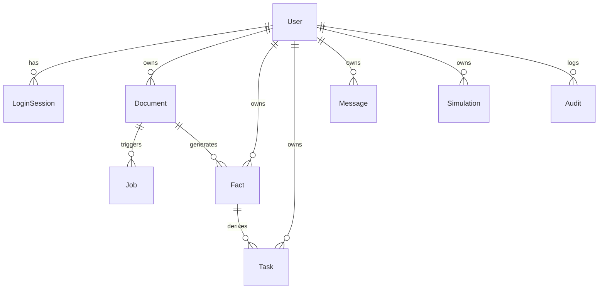

# APEX 珊瑚红乳腺 AI 全周期照护与价值决策平台
# 产品需求文档 (Product Requirements Document - PRD)

| 文档版本 | 状态 | 编写/更新日期 | 适用系统 |
| :--- | :--- | :--- | :--- |
| **v2.1.0** | **正式发布 (评审通过)** | **2026-09-09** | **APEX 乳腺 AI 照护与决策平台 (Web / API)** |

---

## 1. 文档概述与项目背景

### 1.1 项目背景
乳腺癌是全球及中国女性发病率最高的恶性肿瘤之一。早期筛查、规范随访与长期照护管理是降低死亡率、提高患者生存质量的关键。然而，当前在“患者自我照护”与“医疗机构筛查决策”两个端侧存在显著断层：
1. **患者端痛点**：
   - **资料碎片化与解读壁垒**：患者手握大量的检查单、病理报告、门诊病历（纸质照片、扫描件、PDF），专业医学术语晦涩，难以自行建立完整病史链条。
   - **随访脱落与依从性差**：复诊周期长、用药与检查时间繁杂，极易遗忘或混淆日期，缺乏结构化的照护提醒。
   - **信息安全与医疗误导**：通用消费级大模型存在幻觉风险，患者直接咨询可能获得无依据甚至是错误的诊疗建议。
2. **机构/决策端痛点**：
   - **筛查方案价值测算困难**：医疗机构或卫生管理部门在规划引进新技术（如数字乳腺断层合成摄影 DBT）或扩大筛查覆盖面时，临床效果与经济成本（ROI）难以精准量化。
   - **参数孤岛与循证缺失**：流行病学参数、检出率、召回率、治疗成本等分散在文献与历史系统，测算过程缺乏权威循证依据支撑。
   - **大模型“算术幻觉”**：通用大语言模型无法胜任确定性经济学仿真计算，不可直接作为医疗管理决策的计算引擎。

### 1.2 产品愿景与定位
**APEX 珊瑚红照护与价值决策平台**（简称 **APEX**）是一个双轮驱动的医疗级智能化数字平台：
- **C端（患者优先照护平台）**：PC优先、手机自适应的个人就医照护工作台。通过权威 OCR 与多模态解析，实现患者纸质/电子病历的结构化归档、人工确认事实链、确定性日程派生以及严格“有据可依”的安全问答。
- **B端（机构决策与价值评估平台）**：连接医院真实数据、PubMed 循证医学文献、确定性卫生经济学数学内核的管理决策工作台。提供乳腺筛查覆盖率方案的情景推演、敏感性分析、风险外展模拟及合规审计报告。

### 1.3 核心设计哲学与红线原则
1. **“AI 提建议，模型做计算，人作最终确认”**：
   - 大模型（LLM）仅负责自然语言意图理解、文献检索式构建、事实初筛提取与报告文字草拟；
   - 确定性算法/数学内核负责全部数据清洗、统计分析、事实版本锁、日历任务生成与 ROI 经济学仿真计算；
   - 任何关键医学事实、经济测算参数、外展方案与最终报告，均必须经过人工确认（Human-in-the-Loop）方可生效。
2. **“无凭据不妄言，全链路可溯源”**：
   - 系统提取的事实必须关联原文切片、页码和原件坐标高亮；
   - 问答系统严格限定在已核对事实与经审核指南范围，无证据明确拒答，杜绝自由发挥。
3. **“权限物理/逻辑隔离与境内数据合规”**：
   - 严格区分演示环境与真实资料环境（`APEX_ALLOW_REAL_UPLOADS` 门控）；
   - 纯国产境内合规基础设施（境内部署、本地/专有云数据库、百度合规 OCR、月之暗面 Kimi 境内接口）；
   - 严格的多租户所有权鉴权，禁止跨租户数据越权与匿名公开访问。

---

## 2. 目标用户与使用场景

### 2.1 用户画像与角色定义

| 角色标识 | 角色名称 | 典型用户特征 | 核心痛点与诉求 |
| :--- | :--- | :--- | :--- |
| **C-User** | 乳腺患者 / 筛查高危女性 | 确诊术后随访患者、正在化疗/内分泌治疗患者、乳腺结节随访人群 | 病历单据杂乱，搞不清下次复查时间和抽血要求，担心 AI 瞎说 |
| **B-Admin** | 医院管理层 / 院长 / 运营总监 | 关注医院科室发展投入产出比、医保结余、耗材与设备投资回报 | 缺乏直观可信的定量测算模型，难以向卫健/医保或院委会汇报 |
| **B-Doctor** | 乳腺专科主任 / 影像中心负责人 | 关注 DBT 筛查新技术的早期癌症检出率、召回率、早期分期改善 | 需要结合权威医学文献（如 PubMed）与本科室历史数据论证必要性 |
| **B-Analyst** | 医院数据分析员 / 公卫项目专员 | 负责上传和处理科室筛查 CSV 数据，进行人群风险分层与外展跟踪 | CSV 格式不规范、字段缺失，需要快速质检和外展名单优先级排序 |

### 2.2 核心业务使用流程

```mermaid
flowchart TD
    subgraph C端：患者照护闭环
        C1[上传病历/报告/图片] --> C2[百度PaddleOCR-VL解析]
        C2 --> C3[智能抽取结构化事实]
        C3 --> C4[双栏原文对照: 人工逐条核对]
        C4 --> C5{是否含确定日期?}
        C5 -- 是 --> C6[生成照护日历与任务待办]
        C5 -- 否 --> C7[仅归入持续健康档案]
        C4 --> C8[写入pgvector专属向量库]
        C8 --> C9[有依有据的智能随访问答]
    end

    subgraph B端：机构ROI决策闭环
        B1[导入科室筛查CSV数据] --> B2[自动化质量检查与清洗]
        B2 --> B3[自然语言输入决策场景]
        B3 --> B4[Kimi解析意图 + NCBI PubMed实时文献检索]
        B4 --> B5[循证参数候选与人工治理审批]
        B5 --> B6[确定性Python ROI数学模型测算]
        B6 --> B7[多情景推演与敏感性分析]
        B7 --> B8[风险人群外展模拟与模型评估]
        B8 --> B9[生成合规审计管理层报告并导出]
    end
```

---

## 3. 系统整体技术架构与安全边界

### 3.1 架构拓扑设计

```text
+-----------------------------------------------------------------------------------+
| 前端表现层 (React 18 + TypeScript + Vite + Vanilla CSS)                           |
| - PC 优先三栏布局 (左导航 + 中间工作流 + 右侧日历/上下文) / 移动端自适应底部导航        |
| - 珊瑚红专业医疗视觉规范 (#CF4E57) + 响应式交互 + 无障碍对比度 (4.5:1)                |
+-----------------------------------------+-----------------------------------------+
                                          | HTTPS / RESTful API / NDJSON Stream
+-----------------------------------------v-----------------------------------------+
| 服务端业务层 (FastAPI + Python 3.12 纯函数计算内核)                               |
| - 权限与安全：HttpOnly Cookie 会话、CSRF Token 防护、租户隔离认证                     |
| - 数据契约：Pydantic v2 强类型约束校验、Fact/Task 版本锁并发控制                      |
| - 任务调度：持久化 Job 队列、失败重试与同账户 SHA-256 去重机制                        |
+--------+-----------------------+--------------------+---------------------+-------+
         |                       |                    |                     |
+--------v-------+       +-------v--------+   +-------v--------+    +-------v-------+
| 数据持久与存储  |       | OCR 解析引擎    |   | 智能推理与检索  |    | 外部循证接口  |
| - Supabase PG  |       | - 百度托管      |   | - LangGraph    |    | - NCBI PubMed |
|   (PostgreSQL) |       |   PaddleOCR-VL |   | - 月之暗面     |    |   E-utilities |
| - pgvector 384 |       |   异步解析接口  |   |   Kimi K3      |    |   实时检索API |
| - 私有 Storage |       | - 表格/版面还原 |   | - 本地余弦重排 |    |               |
+----------------+       +----------------+   +----------------+    +---------------+
```

### 3.2 运行环境与合规配置矩阵

| 配置键名 | 说明 | 安全与合规要求 |
| :--- | :--- | :--- |
| `DATABASE_URL` | PostgreSQL 数据库连接串（带连接池） | 生产环境启用 SSL，禁止向客户端暴露 |
| `SUPABASE_URL` / `KEY` | 私有原件存储桶通信凭证 | 仅服务端使用 `SERVICE_ROLE_KEY`，前端无权直连 |
| `BAIDU_OCR_API_KEY` | 百度智能云 PaddleOCR-VL 鉴权 | 服务端代理调用，保留原件版面与页码坐标 |
| `APEX_LLM_API_KEY` | 月之暗面 Moonshot (Kimi K3) API 密钥 | 采用境内合规接口 `https://api.moonshot.cn/v1` |
| `APEX_ALLOW_REAL_UPLOADS`| 真实患者资料上传总闸门 | **默认为 false**；仅在完成等保合规后方可开放 |
| `APEX_ALLOW_DEMO` | 是否开放免密独立演示沙盒 | 演示沙盒使用虚拟隔离租户与虚构数据，随时重置 |

---

## 4. 详细功能规格：患者优先照护平台 (C端)

### 4.1 医疗资料接入与异步解析 (Ingestion & OCR)
- **支持格式**：PDF（文字型/扫描型）、Word（.docx，支持嵌入表格与内嵌图）、TXT、手机照片（JPG/PNG/WEBP）。
- **上传限制**：单文件 ≤ 10MB，整批次 ≤ 5 个文件；支持客户端格式预检与移除。
- **文件去重**：服务端对上传文件流计算 SHA-256 哈希，同租户已存在相同文件时复用原有解析，避免重复消耗 OCR 与存储资源。
- **异步处理状态机**：
  - 状态包括：`上传中 (uploading)` -> `排队中 (queued)` -> `解析中 (processing)` -> `待核对 (ready_for_review)` -> `部分失败/失败 (failed)`。
  - 前端支持切页后台运行，刷新后通过 `/api/workspace` 恢复进度。
  - 任务失败支持 `/api/documents/{id}/retry` 单独重试；图片/嵌套表格漏读时强制阻断并提示，严禁静默丢页。
- **原件安全预览**：通过 `/api/documents/{id}/file` 走服务端认证代理，支持受限图片/PDF Inline 预览，严禁开放免密公网 URL。

### 4.2 事实抽取与人工对照核对 (Fact Extraction & Review)
- **事实结构化分类**：
  1. `诊断事实 (Diagnosis)`：病理类型、分子分型（ER/PR/HER2/Ki-67）、TNM 分期、病灶位置。
  2. `用药事实 (Medication)`：药品通用名、剂量、频次、给药途径、疗程周期。
  3. `复诊事实 (Follow-up)`：复查科室、医生要求、就诊时间、复诊目的。
  4. `检查事实 (Exam/Lab)`：乳腺超声、钼靶、MRI、血常规、肿瘤标志物等。
  5. `手术/处置事实 (Procedure)`：手术名称、术式、切口愈合情况。
- **逐条人工核对（核心安全门控）**：
  - **默认状态**：所有由 AI 提取出的事实实体，初始状态均为 `待核对 (pending)`。
  - **对照体验**：PC 端左右双栏对照（左侧原件 PDF/图片渲染高亮切片，右侧事实卡片）；移动端上下层叠对照。
  - **核对动作**：
    - `确认加入 (Confirm)`：将事实变更为已确认，激活其后续在任务与问答中的效力。
    - `排除/有误 (Reject)`：标记为无效事实，记录用户备注，不进入档案。
    - `撤回 (Revoke)`：已确认的事项允许撤回，撤回时同步级联冻结其派生的一切未来任务。
  - **并发与版本控制**：修改事实携带 `version` 乐观锁；版本冲突时返回 `HTTP 409` 并要求前端重新拉取最新状态。

### 4.3 智能照护日历与执行清单 (Care Tasks)
- **任务生成规则**：
  - **强日期约束**：只有**核对状态为“已确认”**且**具有明确公历日期**的事实（如“2026-10-15 复查乳腺超声”），系统才允许创建日程任务；
  - **模糊日期防御**：若文本仅包含“两周后复查”、“半年后随访”等模糊相对时间，系统仅列为待核对事项或备注备忘，**严禁猜测具体日期直接落入日历**。
- **任务状态流转**：
  - 状态：`待办 (pending)`、`已完成 (completed)`、`已跳过 (skipped)`。
  - 状态修改要求：当事实撤回重新确认后，系统必须保留已完成任务的历史勾选状态，不重复新建任务，历史任务不得误判为逾期。
- **日历视图**：提供“今日待办”、“本周日程”、“月度日历看板”切换，支持快捷标记完成与查看关联事实出处。

### 4.4 个人健康档案与就诊准备 (Health Profile)
- **持续时间轴**：按时间倒序串联患者全部历史就诊、检查、手术和用药轨迹。
- **就诊准备摘要导出**：一键聚合“当前用药清单”、“近期异常指标”、“待向医生咨询问题”，生成轻量化 PDF/Markdown 打印版，方便患者就医携带。

### 4.5 严谨有依据的知识问答系统 (Grounded Q&A)
- **架构机制**：基于 LangGraph 编排 + Kimi K3 模型 + 本地 384 维向量检索。
- **混合检索与分流**：
  1. `个人档案事实库`：从 `document_chunks` 过滤 `user_id` 与 `review_status=confirmed`，通过余弦相似度精准检索个人事实；
  2. `公共乳腺指南知识库`：经临床专家审核的公共科普知识片段。
- **响应流程**：通过 NDJSON 流式协议（`/api/messages`）逐段吐出思考检索状态 -> 逐字流式呈现回答正文 -> 尾部附上校验通过的依据切片（含原文档名、页码、确认状态）。
- **红线安全边界**：
  - 遇到剂量调整、私自换药、手术方案选择等高危问题，系统触发安全拦截规则，给出标准免责提示并建议患者立即联系主治团队。
  - 检索无充分匹配事实时，明确回复“根据您已确认的病历资料，暂未找到相关记录”，严禁臆造。

---

## 5. 详细功能规格：机构决策与价值评估平台 (B端)

### 5.1 医院数据接入与质量清洗 (Data Ingestion & Check)
- **数据源输入**：支持医疗机构上传筛查人群 CSV 文件（单文件 ≤ 4MB，行数 ≤ 50,000 行），或一键加载系统内置合成基准数据集。
- **自动化字段校验**：
  - 关键字段检测：患者唯一标识（去标识化）、年龄、性别、筛查日期、筛查类型（常规钼靶 / DBT）、BI-RADS 分级、病理结果、既往筛查史等。
  - 规则清洗：自动识别非法日期格式、年龄超出范围（<18 或 >100）、重复记录判定。
- **派生统计指标**：自动输出有效样本量、平均年龄、当前基线筛查覆盖率、高危人群占比等派生指标，并显式标注其派生规则公式，供后续模型绑定。

### 5.2 智能 AI 决策助手 (Decision Assistant)
- **自然语言意图转参数**：
  - 允许管理人员直接输入业务规划目标，例如：“计划在未来两年将我院 40–74 岁目标人群的 DBT 筛查覆盖率从当前 35% 提高到 65%”。
  - Kimi K3 智能解析该自然语言，结构化提炼出：目标人群基数、目标筛查率、规划周期等参数。
- **PubMed 检索式智能生成**：根据场景特征，自动构建医学文献库标准检索表达式（如 `"Mammography"[Mesh] AND "Digital Breast Tomosynthesis" AND "Screening" AND ("Detection Rate" OR "Recall Rate")`）。

### 5.3 实时循证证据检索与参数治理 (Evidence & Governance)
- **PubMed 实时联动**：通过后端集成 NCBI E-utilities 官方 API，按检索式实时获取 PubMed 最新文献的 PMID、标题、出版年份、摘要等元数据。
- **证据参数智能抽取**：LLM 从文献摘要中提取 DBT 癌症检出率（CDR，每千人）、召回率（Recall Rate）、活检阳性预测值（PPV3）等关键参数数值及引文字段。
- **参数治理三道防线**：
  1. `本地校验`：后台对提取出的数值与单位进行字面正则比对，若文献原文未提及，严禁补全虚构数值；
  2. `医院实测优先`：若科室 CSV 中已存在真实实测参数，系统默认置顶实测值，AI 候选值仅作循证参考；
  3. `人工审批落库`：所有参数必须由经授权的操作员（`institution_access`）手动点击“批准并应用”，参数打上批准人与时间戳，冻结存入 `Simulation` 方案版本库中。

### 5.4 确定性乳腺筛查 ROI 仿真引擎 (Deterministic ROI Engine)
*严格由 Python 后端纯函数计算，不依赖任何大模型的数学逻辑，确保计算过程 100% 确定、可复现、可审计。*

#### 核心数学计算模型：
1. **新增筛查人数**：
   $$\Delta N_{\text{screen}} = N_{\text{target}} \times \max(R_{\text{target}} - R_{\text{current}}, 0)$$
2. **额外癌症检出病例数**：
   $$C_{\text{detected}} = \Delta N_{\text{screen}} \times \frac{\text{CDR}_{\text{DBT}} - \text{CDR}_{\text{DM}}}{1000} \times \alpha_{\text{age}}$$
   *(其中 $\text{CDR}$ 为每千人检出率，$\alpha_{\text{age}}$ 为年龄层风险校正系数)*
3. **召回随访人数**：
   $$N_{\text{recall}} = \Delta N_{\text{screen}} \times \text{Rate}_{\text{recall}}$$
4. **早期发现导致的治疗成本节约**：
   $$\text{Savings}_{\text{treatment}} = C_{\text{detected}} \times \Delta P_{\text{early\_shift}} \times (Cost_{\text{late\_stage}} - Cost_{\text{early\_stage}})$$
   *(早期分期下移带来的远期医疗费用显著下降)*
5. **项目总投入成本**：
   $$\text{Cost}_{\text{total}} = (\Delta N_{\text{screen}} \times Cost_{\text{unit\_screen}}) + (N_{\text{recall}} \times Cost_{\text{unit\_recall}}) + Cost_{\text{outreach\_overhead}}$$
6. **项目净财务收益 (Net Benefit) 与 ROI**：
   $$\text{Net Savings} = \text{Savings}_{\text{treatment}} - \text{Cost}_{\text{total}}$$
   $$\text{ROI} = \frac{\text{Net Savings}}{\text{Cost}_{\text{total}}} \times 100\%$$

### 5.5 情景推演与多维敏感性分析 (Scenario & Sensitivity)
- **多情景对照**：系统自动提供三档情景并列对比：
  - `保守情景 (Conservative)`：取检出率下限、低随访完成率、高单人召回成本；
  - `基准情景 (Baseline)`：取医院实测或文献中位数参数；
  - `积极情景 (Optimistic)`：取文献最优检出率、高依从性与高效随访。
- **敏感性分析龙卷风图 (Tornado Diagram)**：
  - 对“DBT 检查单价”、“筛查响应率”、“早期分期改善比例”、“晚期治疗成本”等核心变量逐一进行 $\pm 20\%$ 的单因素扰动；
  - 自动识别出对项目净节约与 ROI 影响权重最高的前 3 项关键驱动因素，协助管理层进行风险防范。

### 5.6 风险人群外展优化模拟 (Outreach Resource Optimization)
- **人群风险打分与排序**：基于年龄、家族史、致密型乳腺特征及既往随访间隔，运行轻量化规则打分模型对目标筛查人群进行升序/降序排队。
- **外展策略对比**：
  - `随机外展策略 (Random Outreach)` vs `风险优先外展策略 (Risk-Prioritized Outreach)`；
  - 测算在有限的外展名额/外展经费限制下，不同策略带来的新增筛查人数与预计检出病例数差异。
- **合规声明与免责拦截**：界面显式警告——“当前外展评分算法为规则启发式模拟模型，非经过外部临床验证的癌症预测模型，不可直接作为个体临床诊断依据”。外展结果仅保存脱敏统计量，不将敏感行明细回写审计日志。

### 5.7 外部诊断模型性能评估 (Model Evaluation)
- **上传脱敏测试集**：支持上传只包含 `label (真值 0/1)` 与 `score/prediction (模型分值或预测分类 0/1)` 的 CSV 文件。
- **评估指标自动计算**：
  - 混淆矩阵 (TP, FP, TN, FN)；
  - 准确率 (Accuracy)、敏感度 (Sensitivity / Recall)、特异度 (Specificity)、阳性预测值 (Precision)、F1-Score；
  - 帮助机构评估拟采购或自研乳腺 AI 辅助阅片软件的基础性能指标。

### 5.8 严谨管理层合规报告生成 (Executive Report)
- **生成架构**：
  - 锁定后端已批准的计算结果快照（包含全部输入参数、公式中间量、净收益与敏感性表）；
  - Kimi K3 撰写专业商业与临床价值分析叙述；
- **数字与引用一致性硬校验**：
  - 后端对 LLM 返回的 Markdown 报告正文执行全文扫描校验；
  - 报告中出现的每一个关键数字（如“净节约 124.5 万元”、“ROI 18.2%”）与文献引用 PMID，必须与锁定快照完全一致；
  - 若存在编造数字或虚假 PMID，**强制丢弃本次生成并报错阻断**，确保报告 100% 严肃可靠。
- **成果交付物**：支持一键导出包含审批签批人、数据来源快照、计算表格与学术依据的完整 Markdown / PDF 报告。

---

## 6. 非功能性需求 (NFR) 与技术规范

### 6.1 准确性与确定性指标 (Deterministic Accuracy)
1. **数学计算零误差**：所有指标、财务、统计及百分比计算，一律使用 Python 确定性纯函数，误差率为 0%。
2. **来源引用可追溯率**：
   - 患者端结构化事实的原文匹配率要求 100%；
   - 知识问答引文片段与原文档位置吻合率要求 100%；
   - 机构端报告中引用的 PMID 与 PubMed 官方记录一致率要求 100%。

### 6.2 安全、隐私与权限合规 (Security & Compliance)
1. **网络传输与接口安全**：
   - 全面启用 HTTPS (TLS 1.3)；
   - 鉴权采用服务端 HttpOnly + SameSite Cookie 机制；
   - 所有非幂等写操作（POST / PATCH / DELETE）强制校验请求头 `X-CSRF-Token`。
2. **多租户与数据所有权隔离**：
   - 数据库每张核心业务表均携带 `user_id`；
   - 服务端接口严格校验当前登录用户与目标资源的归属关系，禁止越权操作；
   - 机构端接口（`/api/institution/*`）必须单独校验 `institution_access` 权限。
3. **数据销毁与生命周期**：
   - 用户注销账户或删除文件时，系统采用级联物理清除（数据库记录、文档切片向量、对象存储原件一并清除）；
   - 严禁在日志中打印患者明文姓名、身份证号、完整病历正文及任何云厂商 Secret Key。

### 6.3 性能与响应指标 (Performance & SLA)
1. **常规请求**：工作台拉取（`/api/workspace`）、事实状态修改等普通交互，P95 响应时间 ≤ 300ms。
2. **长任务协议 (Long-Running Tasks)**：
   - 针对大文件 OCR 解析、PubMed 文献实时拉取、管理层报告生成等耗时任务，采用 NDJSON 流式协议持续返回阶段状态心跳；
   - 单任务最长超时时间为 300 秒；
   - 遇到云厂商瞬间限流或网络抖动，系统内置指数退避重试（最多重试 1 次）。
3. **向量检索性能**：本地 pgvector 384 维余弦检索，单次检索耗时 ≤ 50ms。

### 6.4 界面设计规范与无障碍设计 (UI/UX Standards)
1. **色彩系统**：
   - 核心主色：`珊瑚红 (#CF4E57)` —— 象征生命与温馨关怀；
   - 页面背景底色：`浅暖米白 (#FCFAF9)`；
   - 卡片与高亮底色：`淡珊瑚红 (#FFF0EE)`；
   - 正文字体：深暖灰黑（对比度严格达到 WCAG AA 级 4.5:1 标准）。
2. **响应式断点规范**：
   - **桌面端 (≥960px，基准 1280px / 1440px)**：采用标准三栏式布局（左侧导航 240px，中间主工作流，右侧日历/上下文看板 340px）；
   - **平板端 (680px - 959px)**：侧边栏自动折叠或流式转为纵向排布；
   - **移动端 (<680px，基准 390px)**：隐藏 PC 侧边栏，启用底部固定四大功能 Tab（首页、档案、照护、问答），触控目标高度 ≥ 44px。
3. **文案风格规范**：
   - 保持医学严肃性与共情温暖度；
   - 严禁使用“棒棒的”、“真厉害哦”等过度幼态化文案；
   - 状态必须“文字 + 颜色 + 图标”三重表达，严禁仅依靠红绿颜色传达关键状态。

---

## 7. 核心数据模型与实体契约 (Data Schema)



### 7.1 主要数据实体定义

| 实体名 | 存储表名 | 核心属性字段 | 业务作用与说明 |
| :--- | :--- | :--- | :--- |
| **User** | `users` | `id, username, is_demo, institution_access, created_at` | 用户主体，支持演示临时沙盒与正式机构用户区分 |
| **Document**| `documents` | `id, user_id, filename, file_size, sha256, storage_path, status, pages` | 患者/机构上传的原件文件元数据 |
| **Job** | `jobs` | `id, document_id, job_type, status, retry_count, error_msg, created_at` | 异步后台批处理任务跟踪表 |
| **Fact** | `facts` | `id, document_id, user_id, category, content, provenance, review_status, version` | 提取出的结构化事实，带原文切片与人工核对状态 |
| **Task** | `tasks` | `id, user_id, fact_id, title, due_date, status, version` | 严格由确定日期事实派生的照护日历待办任务 |
| **Message** | `messages` | `id, user_id, role, content, references, model_name, created_at` | 知识问答对话历史与经校验的来源切片 |
| **Simulation**| `simulations` | `id, user_id, name, inputs_json, outputs_json, approved_by, created_at` | 机构端已锁定的 ROI 方案计算快照与输入参数全集 |
| **Audit** | `audit_logs` | `id, user_id, action, entity_type, entity_id, payload_json, timestamp` | 机构端参数修改、报告审批等关键合规审计记录 |

---

## 8. 实施路线图与验收交付标准

### 8.1 阶段里程碑规划

```text
2026-Q3 (已完成)                      2026-Q4 (当前阶段)                    2027-Q1 (规划阶段)
+-------------------------------+   +-------------------------------+   +-------------------------------+
| Phase 1: 核心逻辑验证与原型     |   | Phase 2: 完整工程落地与合规收口 |   | Phase 3: 机构试点与生产上线   |
| - Python 纯函数 ROI 内核      |-->| - 珊瑚红 PC/移动端统一 UI 实现  |-->| - 境内云基础设施安全等保评测  |
| - Streamlit 快速验证原型      |   | - 百度 PaddleOCR-VL 异步接入  |   | - 真实脱敏患者资料试点试用    |
| - PubMed 实时检索与抽取测试   |   | - Kimi K3 LangGraph 问答工作流|   | - 医院 HIS / PACS 接口标准定制|
| - 确定性数学算法基线通过      |   | - 机构全流程闭环 (检查/ROI/报告)|   | - 多中心筛查价值研究成果沉淀  |
+-------------------------------+   +-------------------------------+   +-------------------------------+
```

### 8.2 验收清单与准入准出标准 (Acceptance Criteria)

| 序号 | 验收模块 | 验证方式与测试用例 | 合格判定标准 |
| :--- | :--- | :--- | :--- |
| **AC-01** | **账户隔离性** | 创建两个独立账户 A 与 B，A 上传病历，B 尝试通过 ID 获取或下载 | 接口严格返回 `404 Not Found`，无法跨账户越权访问 |
| **AC-02** | **去重与重试** | 同一账户连续上传相同文件；模拟 OCR 网络抖动抛出异常 | 相同文件秒级命中去重逻辑；失败任务允许重新排队恢复 |
| **AC-03** | **核对与任务联动**| 确认一条“2026-10-15 复查”事实；标记任务完成；随后撤回该事实确认 | 确认时生成任务；撤回时任务冻结；再次确认恢复原完成状态 |
| **AC-04** | **模糊时间防御** | 上传包含“建议两周后复诊”的文本事实 | 仅列入待核对事项，日历中**严禁猜测并自动创建任务** |
| **AC-05** | **问答引用白名单**| 提问个人病情问题；提问超纲改药问题 | 回答附带经校验的个人病历出处；改药问题触发安全拒答拦截 |
| **AC-06** | **确定性 ROI 计算**| 给定固定基准输入参数（40-74岁，筛查率 35%->65%），对比纯函数计算值 | 输出的新增筛查数、检出数、净节约与 ROI 100% 精确一致 |
| **AC-07** | **报告防幻觉校验**| 模拟 LLM 在生成管理层报告时修改了净节约数字或伪造了 PMID | 后端数字与引用校验拦截报警，报告**严禁落地保存** |
| **AC-08** | **响应式布局测试**| 浏览器分辨率在 1440px、960px、390px 之间平滑切换 | 1440px 呈现三栏；390px 自动切换底部四 Tab，无遮挡与横向滚动条 |

---
*文档编制单位：APEX 联合研发与医学工程团队*  
*最新修订归档路径：`deliverables/PRD-乳腺AI平台产品需求文档.md`*


系统提示词：你判断是否需要调用工具，现在有的工具有
1.墨迹天气 ，函数为get_weather，参数是city代表城市，字符串类似

返回的时候使用xml方式表示工具调用，例如<tool><get_weather city="北京"></tool>

function get_weather(city: str) -> str:
    """获取城市天气"""
    return "晴天"


我 ： 今天天气怎么样

AI：我需要先调用工具，<tool> <get_weather city="北京"></get_weather></tool>


息返回字段示例：
– "city": {
"country_code": "CN",
"country_enname": "China",
"country_name": "中国",
"enname": "Minhang District",
"id": 50,
"latitude": 31.112732,
"longtitude": 121.381375,
"name": "闵行区",
"parent_ennames": "Shanghai",
"parent_names": "上海市",
"天气”：“多云”


function call

tool_use

AI：今天北京的天气是多云


